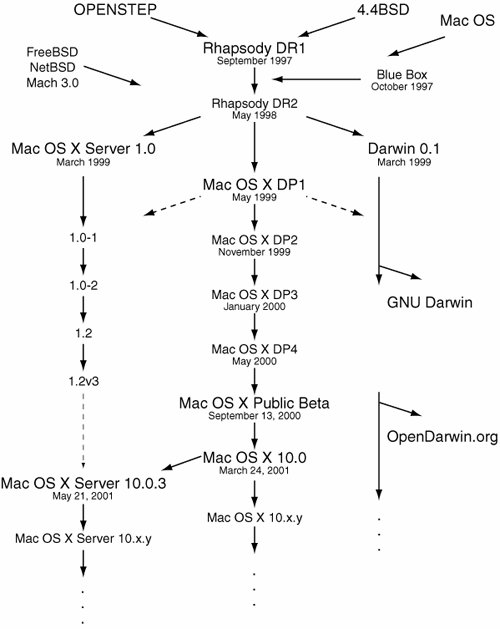
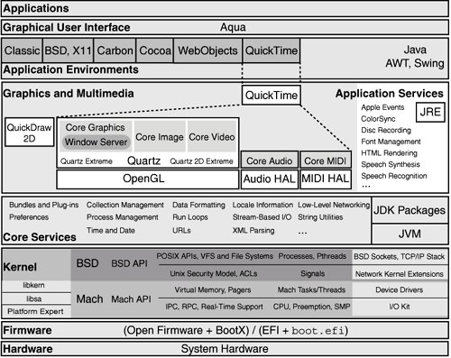

# Notes on *Mac OS X Internals: A system Approach*

## Book Info

ISBN: 978-0-13-442654-9
Author: Amit Singh
Publish Year: 2011

## Introduction

Mac OS X was released in March 2001, but many components, such as Mach and BSD, are considerably older. Understanding the design, implementation, and workings of Mac OS X requires examination of several technologies that differ in their age, origins, philosophies, and roles.

## Origins of Mac OS X

OS X timeline

* 2001-9-13  Mac OS X public beta for $29.95 at Apple Store.
* 2001-3-24  First version of Mac OS X 10.0 Cheetah
* 2001-9-29  10.1 Puma
* 2002-8-23  10.2 Jaguar
* 2003-10-24 10.3 Panther
* 2005-4-29  10.4 Tiger
* 2007-10-26 10.5 Leopard (final PowerPC CPU)
* 2009-6-8   10.6 Snow Leopard (x86 CPU)
* 2010-10-20 10.7 Lion
* 2012-7-25  10.8 Mountain Lion
* 2013-6-10  10.9 Mavericks
* 2014-6-2   10.10 Yosemite
* 2015-6-8   10.11 El Capitan
* 2016-6-13  10.12 Sierra
* 2017-6-5   10.13 High Sierra

## An Overview of Mac OS X

High level architecture of Mac OS X.

Critical components of Mac OS X reside in the `/System/Library/CoreServices/`.

### Firmware

PowerPC-based use Open Firmware.
x86-based use Extensible Firmware Interface (EFI).

## References

* http://www.osxbook.com/
* http://flylib.com/books/en/3.126.1/
